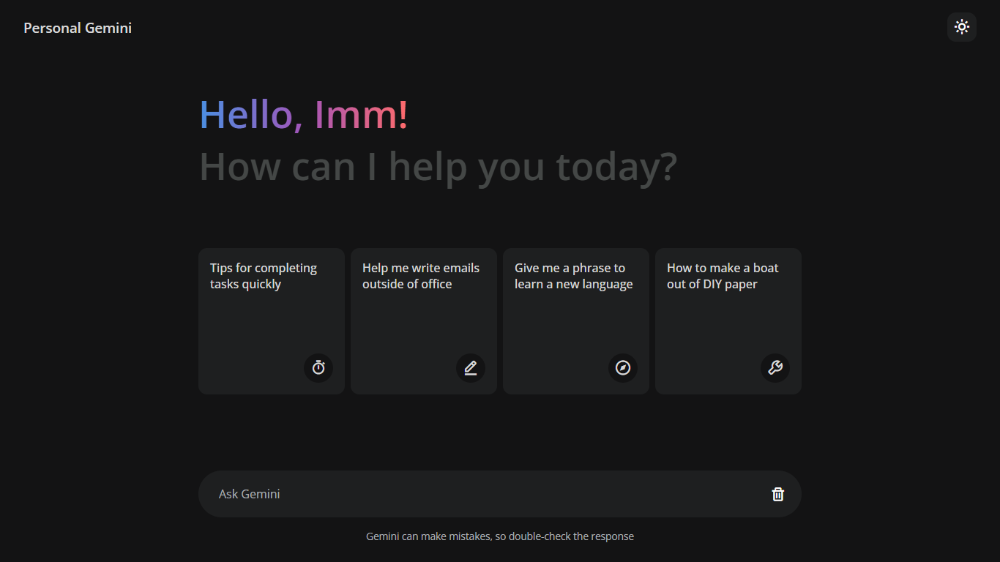

# Google Gemini Clone

- Pengantar Aplikasi Chat Berbasis AI: Pelajari cara membuat aplikasi AI generatif yang mirip dengan Google Gemini atau ChatGPT menggunakan JavaScript murni (vanilla JavaScript). 🤖
- Menghubungkan dengan API Gemini: Temukan cara menggunakan API Gemini untuk menambahkan kemampuan AI ke dalam aplikasi Anda, memungkinkan percakapan dan respons dalam bahasa alami. 🌐
- Implementasi menggunakan JavaScript murni. 💻
- Antarmuka Ramah Pengguna: Rancang antarmuka yang menarik dan responsif untuk pengalaman chat yang menyenangkan, dengan interaksi yang lancar dan respons waktu nyata. 🌟
- Mengoptimalkan Performa: Pelajari cara menjaga aplikasi chat AI Anda tetap efisien dan berjalan lancar di berbagai perangkat dan platform. 🚀

## Warning
Kamu perlu mendapatkan **API Key** milikmu sendiri dan menggantinya di file script.js pada baris ke-12.:

```javascript
const GOOGLE_API_KEY = "Tempel Kode API kalian disini";
```

Kalian bisa dapetin api key nya di: https://ai.google.dev/

# Screenshot
Preview web nya :


